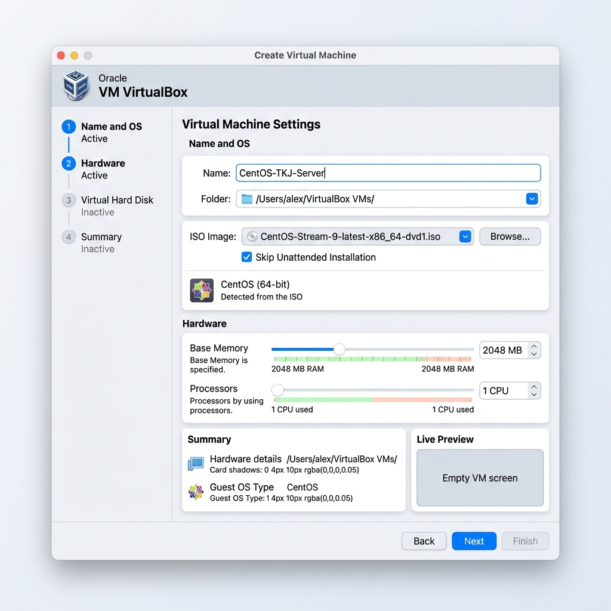
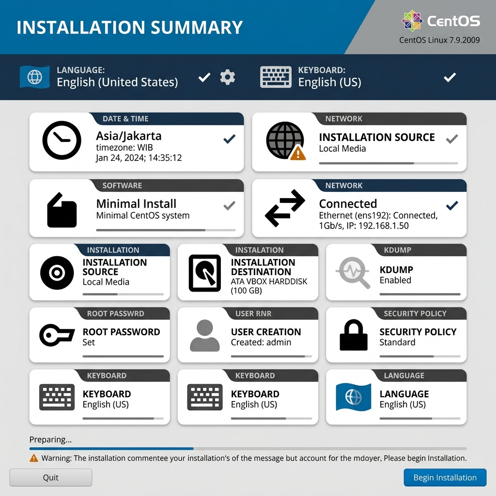
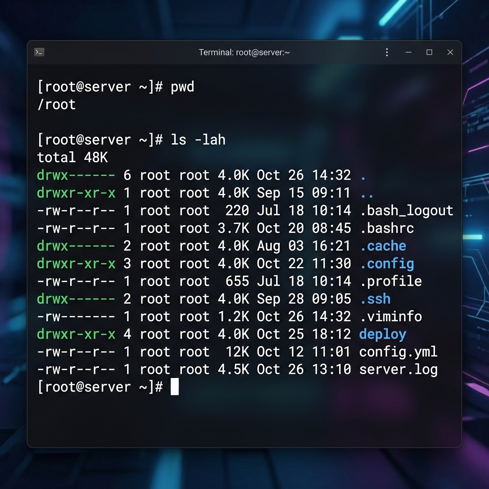
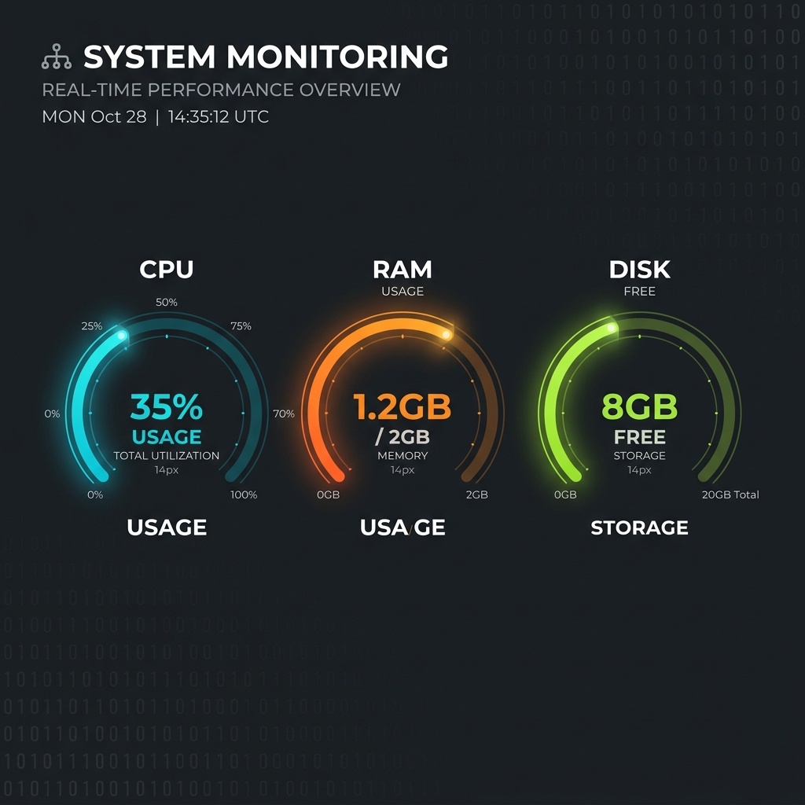
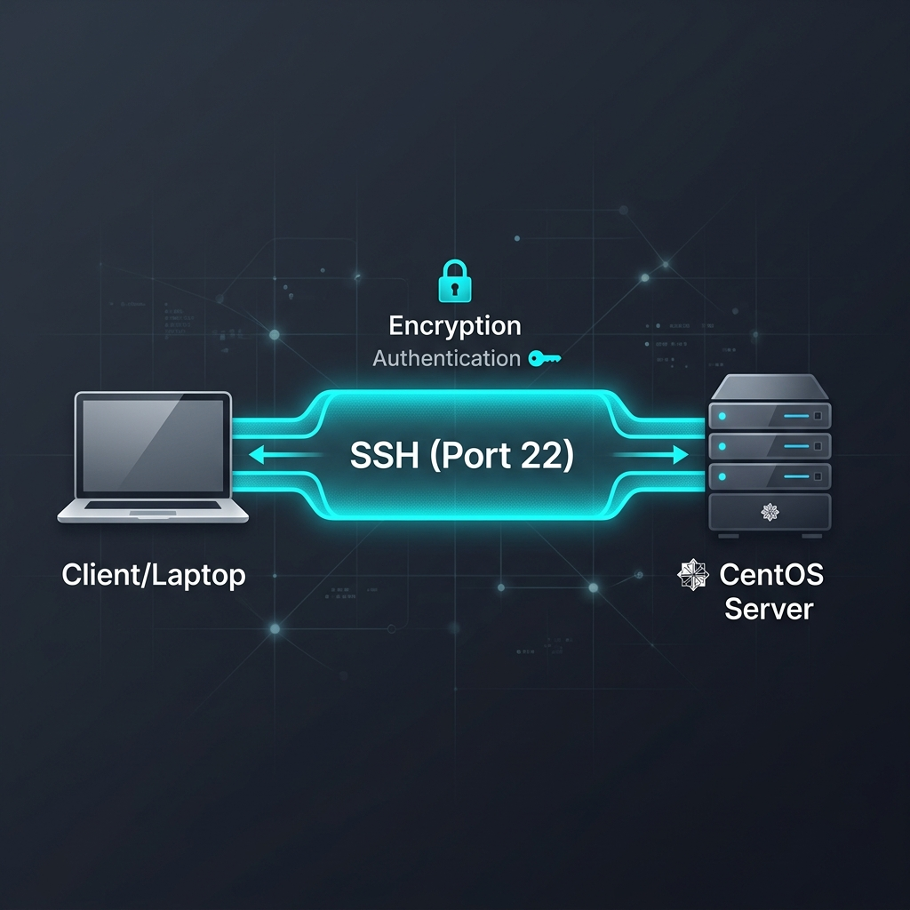
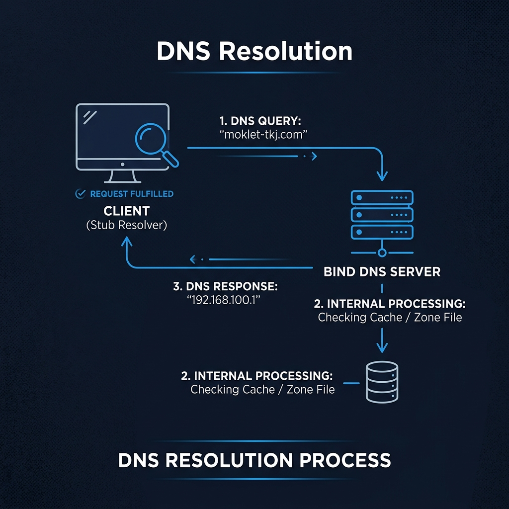
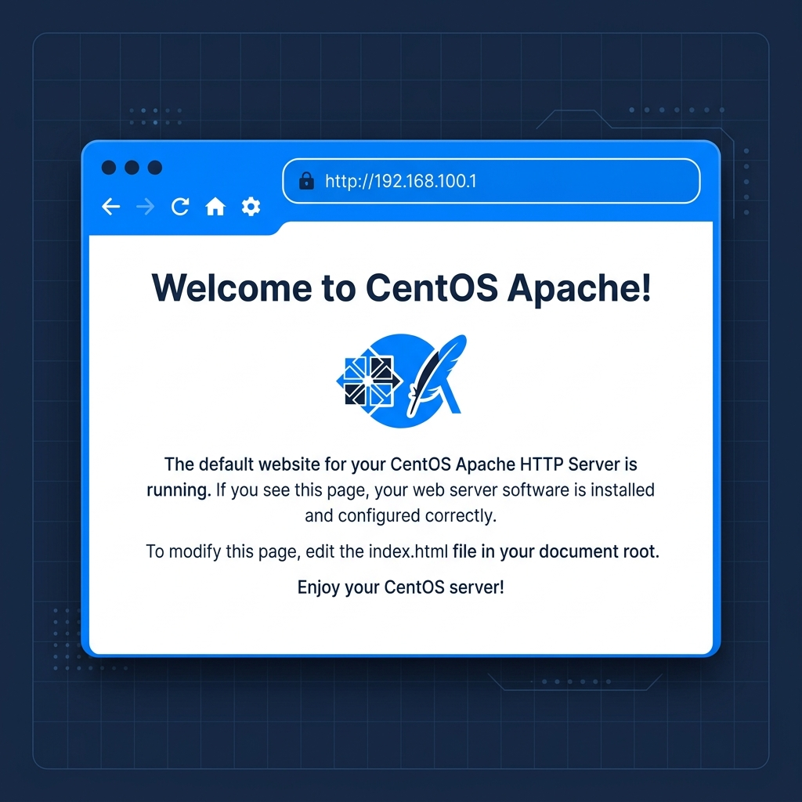
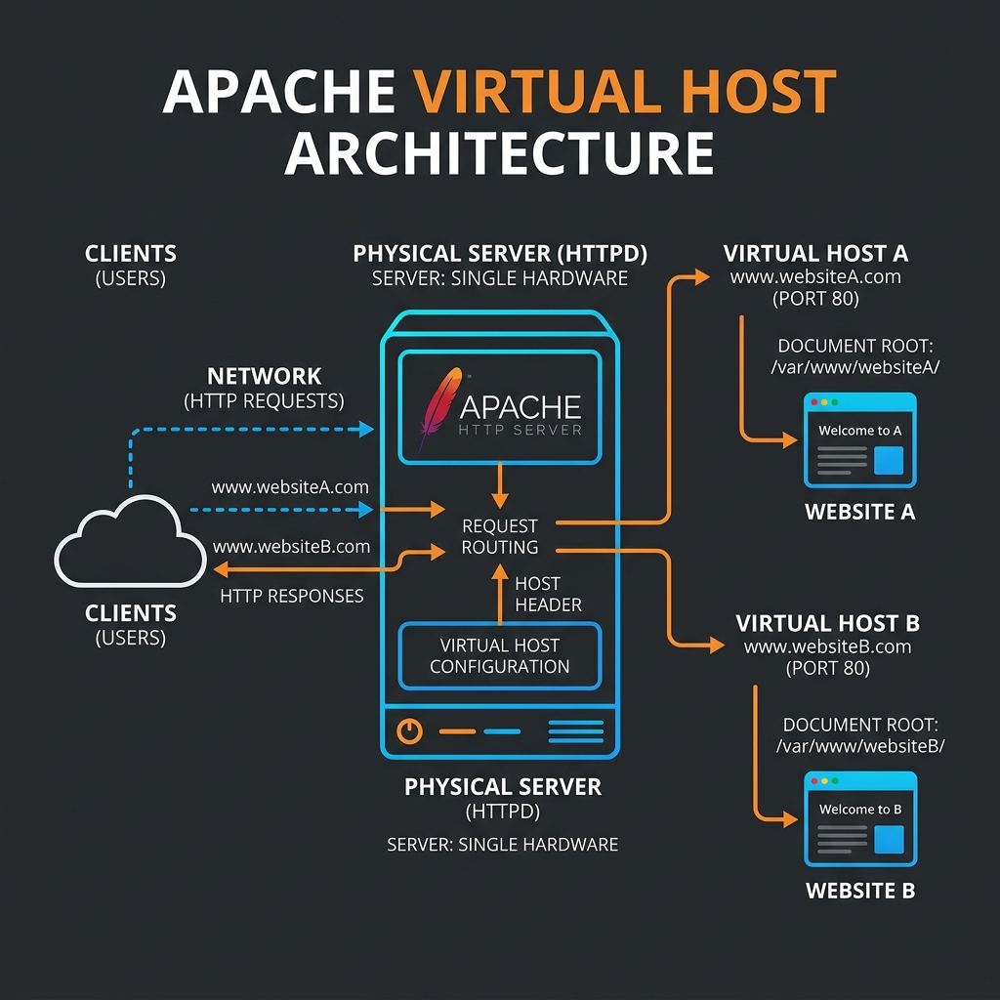
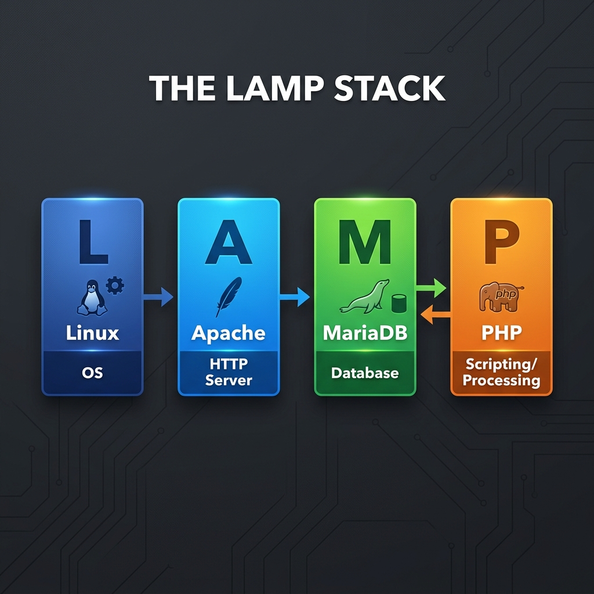
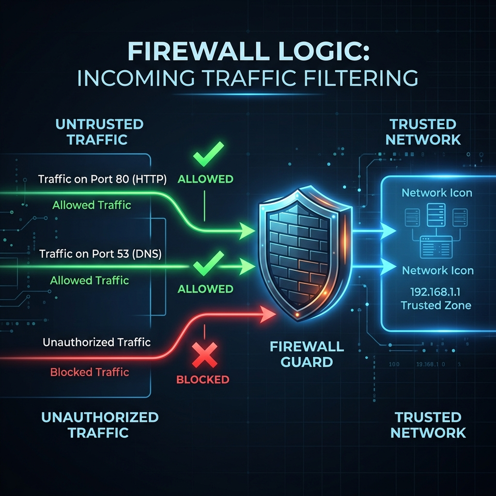

# 📘 Jobsheet Praktikum: Deep Learning Network Engineering
## Kelas X TKJ - SMK Telkom Malang (Detailed Edition)


---

### 📌 Ringkasan Program
Jobsheet ini adalah panduan komprehensif bagi siswa untuk menguasai teknologi jaringan dan server menggunakan CentOS. Kurikulum ini dirancang untuk membawa siswa dari tingkat pemula (dasar virtualisasi) hingga mampu mengelola infrastruktur server yang kompleks.

> [!NOTE]
> **Tujuan Utama**: Membekali siswa dengan keterampilan teknis (*hard skills*) dan dokumentasi profesional (*soft skills*) yang relevan dengan standar industri IT masa kini.

---

## 📦 Modul 1: Fondasi Virtualisasi & Instalasi OS
*(Estimasi: Pekan 1 - 2)*

### 🟦 Pekan 1: Setup Lingkungan Virtual (VirtualBox)
Siswa belajar mengelola *Virtual Machine* (VM) sebagai simulasi server nyata.

#### A. Persiapan Software
1. Unduh **VirtualBox 7.x** dari [virtualbox.org](https://www.virtualbox.org/).
2. Unduh **CentOS 7/8 Minimal ISO**.

#### B. Membuat VM Baru (Step-by-Step)


1. **Klik Button "New"** di dashboard VirtualBox.
2. **Name & Operating System**: 
   - Name: `CentOS-TKJ-Server`
   - Folder: (Biarkan default atau pilih disk D/E jika C penuh).
   - ISO Image: Pilih file ISO CentOS yang sudah diunduh.
   - Type: `Linux`, Version: `Red Hat (64-bit)`.
3. **Hardware Configuration**:
   - **Base Memory**: Geser ke `2048 MB` (Hijau).
   - **Processors**: Minimal `1 CPU` (2 CPU direkomendasikan jika laptop kencang).
4. **Virtual Harddisk**:
   - Pilih "Create a Virtual Hard Disk Now".
   - Size: `20.00 GB`.
5. **Klik Finish**.

#### C. Pengaturan Jaringan (Penting!)
Sebelum dijalankan, klik **Settings > Network**:
- **Adapter 1**: Set ke `NAT` (Agar VM bisa internetan untuk download paket).
- **Adapter 2** (Klik Enable): Set ke `Host-Only Adapter` (Agar VM punya IP yang bisa di-remote dari laptop host).

---

### 🟦 Pekan 2: Instalasi CentOS dengan Pendekatan Server
Instalasi dilakukan dengan mode **Minimal Install** untuk meminimalkan beban sistem.

#### Step-by-Step Installation:


1. **Boot ISO**: Klik **Start** pada VM, lalu pilih "Install CentOS 7".
2. **Language**: Pilih **English (United States)** untuk standar industri.
3. **Installation Summary** (Lengkapi bagian bertanda seru `!`):
   - **Date & Time**: Pilih region `Asia/Jakarta`.
   - **Software Selection**: Pastikan terpilih **Minimal Install** (Jangan pilih GNOME/GUI).
   - **Installation Destination**: Klik disk 20GB tadi, biarkan "Automatic Partitioning" terpilih, lalu klik **Done**.
   - **Network & Host Name**: Nyalakan (ON) semua Ethernet, lalu ganti Hostname menjadi `server.moklet.com`.
4. **Begin Installation**: Klik tombol di pojok kanan bawah.
5. **Configuration**:
   - **Root Password**: Buat yang mudah diingat (Contoh: `moklet123`).
   - **User Creation**: Buat user siswa (Contoh: `siswa`).
6. **Reboot**: Tunggu proses selesai dan klik Reboot.

---

## 💻 Modul 2: Eksplorasi Linux & Remote Management
*(Estimasi: Pekan 3 - 4)*

### 🟦 Pekan 3: Penguasaan Terminal (Deep Dive)
Terminal adalah "nyawa" dari seorang administrator server. Tanpa GUI, kita harus hafal perintah dasar.



#### 1. Navigasi & File System (Fundamental)
- `pwd`: Singkatan dari *Print Working Directory*. Gunakan jika kamu tersesat di folder mana.
- `ls -lah`: 
  - `-l`: List detail (ukuran, izin, pembuat).
  - `-a`: *All* (menampilkan file tersembunyi berawalan titik `.`).
  - `-h`: *Human Readable* (mengubah bytes menjadi KB/MB/GB).
- `cd [path]`: Berpindah folder. Tips: gunakan `cd ..` untuk naik satu tingkat ke atas.
- `mkdir -p project/src`: Parameter `-p` (*parents*) membuat folder bertingkat sekaligus.

#### 2. Manajemen Navigasi Teks (The "Pro" Way)
- `nano [nama_file]`: Editor teks paling ramah pemula.
- `head -n 5 file.log`: Melihat 5 baris pertama saja.
- `tail -f /var/log/messages`: **Sangat Penting!** Melihat log secara *real-time* saat terjadi error.

#### 3. Update & Package Manager
CentOS menggunakan `yum`.
- `sudo yum search [keyword]`: Mencari aplikasi sebelum install.
- `sudo yum install [nama] -y`: Parameter `-y` otomatis menjawab "Yes" saat konfirmasi.

#### 4. System Health Check (Monitoring)
Administrator harus tahu kapan servernya "kelelahan" (kehabisan RAM atau CPU).



- `top`: Melihat proses yang paling banyak memakan CPU secara live. (Tekan `q` untuk keluar).
- `df -h`: Melihat sisa kapasitas harddisk dalam format yang mudah dibaca (GB/MB).
- `free -m`: Melihat sisa RAM dalam satuan Megabytes.

> [!TIP]
> **Tab Completion**: Selalu tekan tombol `TAB` dua kali saat mengetik nama file atau folder agar otomatis terlengkapi. Ini mencegah typo!

---

### 🟦 Pekan 4: Manajemen Jaringan & Remote Server
Administrator jarang masuk langsung ke layar hitam server. Mereka duduk santai di depan laptop dan me-remote server melalui jaringan.

#### 1. Konfigurasi IP Statis (NMCLI)
VM harus punya alamat tetap (statis) agar bisa dihubungi kapan saja.
- **Langkah 1**: Cek nama interface: `nmcli device` (Misalnya `enp0s8`).
- **Langkah 2**: Set IP:
  ```bash
  nmcli con mod enp0s8 ipv4.addresses 192.168.100.1/24 ipv4.method manual
  ```
- **Langkah 3**: Aktifkan: `nmcli con up enp0s8`.
- **Verifikasi**: Ketik `ip a` dan pastikan muncul angka `192.168.100.1` di interface tersebut.

#### 2. Remote Server (SSH & SCP)


SSH (*Secure Shell*) memungkinkan kita mengontrol server secara aman dari laptop.

#### 2.1. Cara Remote dari Laptop (Local Machine)
- **Windows (PowerShell/CMD)** or **macOS/Linux (Terminal)**:
  ```bash
  ssh root@192.168.100.1
  ```
  Jika muncul pesan "The authenticity of host... can't be established", ketik `yes`.

#### 2.2. Cara Kirim File (SCP)
SCP (*Secure Copy*) bekerja di atas protokol SSH.
- **Dari Laptop ke Server**:
  ```bash
  scp index.html root@192.168.100.1:/var/www/html/
  ```
- **Dari Server ke Laptop**:
  ```bash
  # Jalankan di laptop, bukan di VM
  scp root@192.168.100.1:/var/named/moklet.zone ./backup/
  ```

> [!IMPORTANT]
> Pastikan Laptop dan VM berada dalam satu jaringan (Host-Only Adapter) agar bisa saling `ping`.

---

## 🌐 Modul 3: Layanan Inti Jaringan (Detailed Config)
*(Estimasi: Pekan 5 - 6)*

### 🟦 Pekan 5: DNS Server (BIND)
DNS adalah "Buku Telepon" internet yang mengubah nama domain menjadi alamat IP.



#### 1. Instalasi & Basic Config
Lakukan instalasi paket BIND:
```bash
sudo yum install bind bind-utils -y
```

Edit file utama `/etc/named.conf`:
```bash
# Isi konfigurasi penting:
options {
    listen-on port 53 { 127.0.0.1; any; }; # Biarkan server melayani request dari luar
    allow-query { any; };                  # Izinkan semua orang bertanya ke DNS ini
    recursion yes;                         # Izinkan mencari domain luar (Google, dll)
};

zone "moklet-tkj.com" IN {
    type master;
    file "moklet-tkj.com.zone"; # Nama file zone kita
    allow-update { none; };
};
```

#### 2. Membuat Zone File (`/var/named/moklet-tkj.com.zone`)
File ini berisi daftar "kontak" domain Anda.
```bash
$TTL 86400
@ IN SOA ns1.moklet-tkj.com. admin.moklet-tkj.com. (
    2025010101 ; Serial
    3600       ; Refresh
    1800       ; Retry
    604800     ; Expire
    86400 )    ; Minimum TTL

@   IN NS  ns1.moklet-tkj.com.   ; Nama NameServer kita
ns1 IN A   192.168.100.1         ; IP Server kita
www IN A   192.168.100.1         ; IP untuk www
```

#### 3. Verifikasi DNS
Jangan restart sebelum dicek!
- `named-checkconf /etc/named.conf` (Jika tidak muncul apa-apa = Link OK).
- `dig @192.168.100.1 www.moklet-tkj.com` (Uji apakah domain sudah terdaftar).

---

### 🟦 Pekan 6: Web Server (Apache)
Apache memungkinkan kita menghosting website sehingga bisa diakses via browser.

#### 6.1. Instalasi & Aktifasi Layanan
Langkah pertama adalah memasang paket web server Apache:
```bash
sudo yum install httpd -y
systemctl start httpd
systemctl enable httpd
```

#### 6.2. Default Document Root (Akses via IP)
Secara default, Apache akan mencari file di folder `/var/www/html/`.



1. **Membuat Halaman Utama**:
   Gunakan editor `nano` untuk membuat file `index.html` baru:
   ```bash
   nano /var/www/html/index.html
   ```
   Isi dengan kode HTML sederhana:
   ```html
   <h1>Selamat Datang di Server Pusat!</h1>
   <p>Halaman ini diakses langsung menggunakan IP Address Server.</p>
   ```
2. **Pengujian**:
   Buka browser di laptop Anda dan ketikkan IP address server (Contoh: `http://192.168.100.1`). Anda seharusnya melihat tampilan HTML yang baru saja dibuat.

#### 6.3. Konfigurasi Virtual Host (Multi-Domain)
Setelah memahami dasar akses IP, sekarang kita akan belajar cara menghosting banyak domain dalam satu server menggunakan **Virtual Host**.



1. **Buat Folder Khusus Website**:
   ```bash
   mkdir -p /var/www/html/moklet
   echo "<h1>Web Lab TKJ (Virtual Host) Aktif!</h1>" > /var/www/html/moklet/index.html
   ```

2. **Buat File Konfigurasi** (`/etc/httpd/conf.d/moklet.conf`):
   ```apache
   <VirtualHost *:80>
       ServerName moklet-tkj.com
       DocumentRoot /var/www/html/moklet
       
       # Log Aktivitas
       ErrorLog /var/log/httpd/moklet-error.log
       CustomLog /var/log/httpd/moklet-access.log combined
   </VirtualHost>
   ```

3. **Verifikasi & Restart**:
   ```bash
   apachectl configtest   # Pastikan muncul "Syntax OK"
   systemctl restart httpd
   ```

> [!TIP]
> Agar laptopmu bisa membuka `http://moklet-tkj.com` tanpa DNS sungguhan, tambahkan baris `192.168.100.1 moklet-tkj.com` di file **C:\Windows\System32\drivers\etc\hosts** (Windows) atau **/etc/hosts** (macOS).


---

### 🟦 Pekan 7: Database & Dynamic Web (LAMP)
Web modern tidak hanya berisi teks statis, tapi juga data dinamis (seperti login atau konten berita).



#### 7.1. Database Server (MariaDB)
MariaDB adalah tempat menyimpan data user dan konten web.
- **Instalasi**: `sudo yum install mariadb-server -y`.
- **Aktivasi**: `systemctl start mariadb` dan `systemctl enable mariadb`.
- **Set Password**:
  ```bash
  mysql_secure_installation
  ```
  *(Ikuti petunjuk untuk membuat password root database).*

#### 7.2. Dynamic Web (PHP)
Agar website bisa memproses logika (seperti `Halaman Login`), kita butuh PHP.
- **Instalasi**: `sudo yum install php php-mysqlnd -y`.
- **Uji Coba PHP**:
  ```bash
  echo "<?php phpinfo(); ?>" > /var/www/html/moklet/info.php
  systemctl restart httpd
  ```
- **Verifikasi**: Buka `http://moklet-tkj.com/info.php` di browser. Jika muncul tabel ungu berisi informasi PHP, maka server PHP sudah aktif!

---

## 🔍 Modul 4: Security & Troubleshooting
*(Estimasi: Pekan 7)*

### 🛡️ Firewall Management (Firewalld)
Server tidak akan bisa diakses jika port tidak dibuka di firewall. Bayangkan firewall sebagai "Satpam" yang memeriksa setiap tamu yang masuk.



- **Buka Port Layanan**: 
  ```bash
  firewall-cmd --permanent --add-service=dns  # Buka Port 53
  firewall-cmd --permanent --add-service=http # Buka Port 80
  ```
- **Reload Firewall**: 
  Setiap ada perubahan, wajib di-reload agar aktif:
  ```bash
  firewall-cmd --reload
  ```
- **Cek Status**: `firewall-cmd --list-all`.

### 🔧 Troubleshooting Loop (Penyelamatan Server)
Jika service gagal jalan (`Failed`), jangan panik! Ikuti langkah "Detektif" ini:

1. **Cek Status**: `systemctl status httpd` (Cari teks berwarna merah).
2. **Lihat Log Detail**: `journalctl -xe` (Geser ke baris paling bawah untuk melihat penyebab error spesifik).
3. **Cek Koneksi**: `ping 192.168.100.1` (Apakah server masih hidup?).
4. **Cek Port**: `netstat -tulpen | grep 80` (Apakah port 80 sudah ada yang memakai?).

### 🛡️ SELinux (The "Silent Killer")
CentOS memiliki fitur keamanan super ketat bernama **SELinux**. Seringkali konfigurasi kita "BENAR" tapi tetap ditolak oleh sistem.
- **Cek Status**: `getenforce`.
- **Pesan Error Umum**: Jika muncul error `403 Forbidden` padahal izin file sudah benar, biasanya PELAKUNYA adalah SELinux.
- **Solusi Sementara (Lab Only)**: `setenforce 0` (Mengubah status menjadi *Permissive*).

---

## 🚀 Praktikum Lanjut: Studi Kasus & Proyek
*(Pekan 8 - 13)*

Fokus pada kemandirian siswa dalam menghadapi skenario industri:
- **Pekan 8-11: Subdomain & Hardening**
  - Membuat `blog.moklet-tkj.com`.
  - Mengamankan SSH (Mengganti Port 22 ke Port Custom).
- **Pekan 12: Disaster Recovery**
  - Simulasi menghapus file `/etc/named.conf` secara tidak sengaja dan memulihkannya dari backup.
- **Pekan 13: Proyek Akhir Terintegrasi**
  - **Goal**: Membangun infrastruktur web lengkap yang bisa diakses dari laptop dengan domain sendiri, memiliki database MariaDB, memproses script PHP, dan firewall yang terkunci rapat.

---

## 🛠️ Command Toolbox (Quick Reference)

| Kategori | Perintah | Deskripsi |
| :--- | :--- | :--- |
| **System** | `top` / `df -h` / `free -m` | Cek kesehatan CPU/Disk/RAM |
| | `journalctl -xe` | Intip error log sistem terbaru |
| **Network** | `ip a` | Lihat alamat IP interface |
| | `nmcli con up <itf>` | Nyalakan koneksi network |
| **DNS** | `named-checkconf` | Cek typo di config BIND |
| | `dig @localhost <dom>` | Test resolusi domain secara lokal |
| **DB / Web** | `mysql -u root -p` | Masuk ke terminal Database |
| | `tail -f /var/log/httpd/access_log` | Pantau pengunjung web secara live |
| **Security** | `setenforce 0` | Matikan paksa blokir SELinux |

---

## 📊 Matriks Capaian & Checklist
| Modul | Deliverable | Deadline | Status |
| :--- | :--- | :---: | :---: |
| **Modul 1** | Laporan Setup VM & Install OS | Pekan 2 | [ ] |
| **Modul 2** | Akses Remote SSH Success | Pekan 4 | [ ] |
| **Modul 3** | Domain & Web Lab Aktif | Pekan 6 | [ ] |
| **Modul 4** | Database & PHP (LAMP) Ready | Pekan 7 | [ ] |
| **Modul 5** | Laporan Troubleshooting | Pekan 8 | [ ] |
| **Portfolio**| Proyek Akhir (Final Report) | Pekan 13 | [ ] |

---
*Curated with ❤️ for SMK Telkom Malang Students.*
